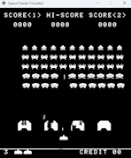

# Space Owner

## Version history

Version|Date|Author|Comments
-------|----|----|--------
1.0|August 13th, 2023|Felipe Dotti|Initial release

## Summary

Hello!

This is a Space Invaders emulator made in C#, called Space Owner. The aim of this emulator is to run the ROM for the original 1978 game made for the Intel 8080 arcade machine and learn more about emulation.

## Minimal Path to Awesome

To run it, just browse the ConsoleApp1/"Space Owner Executable" folder and double-click on Space Owner Emulator.exe. The ROM is already included.

  

## Languages and libraries

- C#
- SDL2

## Prerequisites

* [.NET](https://dotnet.microsoft.com/en-us/download) version 6.0 or higher.

  determine dotnet version
  ```bash
  dotnet --version
  ```

## Structure

- ConsoleApp1/ contains the emulator's source code.
- ConsoleApp1/"Space Owner Executable" contains the emulator already compiled to be run into a Windows machine.

## Controls

The controls are keyboard only. Below are the key bindings:


- 1 – Insert Credit

- Enter (return) – Start

- Key Arrows – Move Ship

- D - Fire

## Testing

For testing the CPU, I have used the cpudiag.asm ROM: http://www.emulator101.com/full-8080-emulation.html.

For testing the game itself, the below resources were useful to check the code's execution:

- https://8080.cakers.io/
- https://www.pcjs.org/machines/arcade/invaders/
- http://computerarcheology.com/Arcade/SpaceInvaders/

The emulator has a debug printing function and a disassembler printing function. They both are commented to not interfere with the performance but can be used if needed.

## Credits


For the CPU emulation, I followed this excellent guide by Emulator 101: http://emulator101.com/.

For the video rendering, I have decided to use the SDL2 bindings for C#: https://jsayers.dev/c-sharp-sdl-tutorial-part-1-setup/.

The audio is not emulated. The emulator plays .wav files as the game demands. The .wav files were obtained here: http://www.classicgaming.cc/classics/space-invaders/sounds.

The Computer Archeology page for Space Invaders (Arcade) was also immensely helpful for understanding the Space Invaders hardware and checking the correct code execution of the game: http://computerarcheology.com/Arcade/SpaceInvaders/

Other publicly available Space Invaders emulators on the Internet also helped me to compare my code against it and see what I was missing to make it work.

And, of course, credit to Taito and Tomohiro Nishikado, for creating the original game in 1978.
